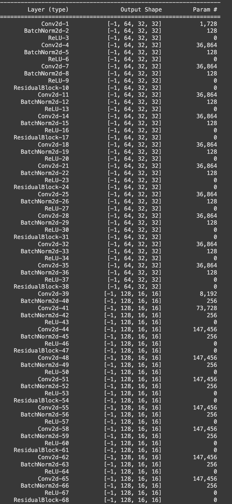

# Session 8 - Deep Residual Network Training

## Model Architecture

The model is a deep residual network with the following characteristics:

- **Total Parameters**: 30,032,292
- **Trainable Parameters**: 30,032,292
- **Non-trainable Parameters**: 0
- **Model Size**: 114.56 MB
- **Estimated Total Size**: 149.77 MB

### Architecture Details

The model consists of:
- Multiple residual blocks with Conv2d, BatchNorm2d, and ReLU layers
- Progressive channel expansion: 64 → 128 → 256 → 512
- Dropout layer (p=0.512) before the final linear layer
- AdaptiveAvgPool2d for global average pooling

## Training Results
<video width="630" height="300" src="./epoch_log.mov" controls></video>   

### Performance Summary

The training shows:
- **Training Loss**: Decreases from ~4.3 to ~1.3 over 200 epochs
- **Test Loss**: Decreases from ~3.7 to ~0.8 over 200 epochs
- **Training Accuracy**: Reaches ~90-95% with high variance
- **Test Accuracy**: Steadily improves to ~82% over 200 epochs

The model demonstrates good learning capability with the test accuracy showing steady improvement, though training accuracy exhibits significant fluctuation typical of deep residual networks.

## Files

- `session_8.ipynb` - Main training notebook
- `save_to_hugging_face.ipynb` - Model saving utilities
- `epoch_log.mov` - Video of training progress