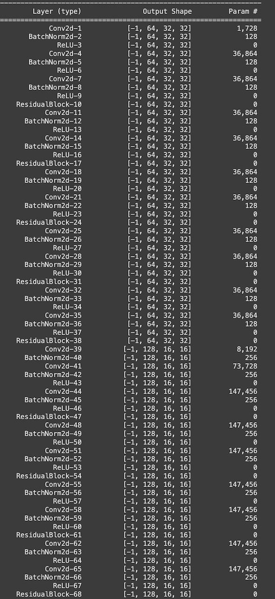
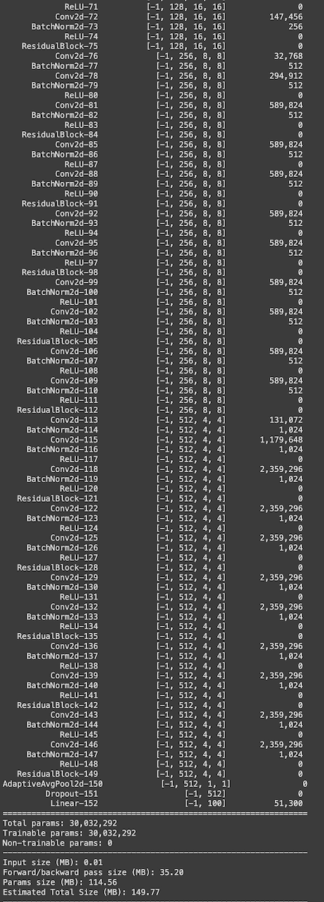
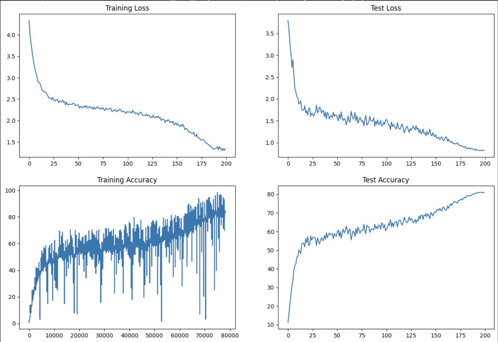

# Session 8 - Deep Residual Network Training

## Overview

- **Model:** WideResNet-28-10
- **Dataset:** CIFAR-100
- **Task:** Image Classification (100 classes)
- **Target Accuracy:** 74-75% test accuracy within 100 epochs

---

## Training Configuration

| Parameter            | Value                                   |
|----------------------|-----------------------------------------|
| Depth                | 28                                      |
| Width                | 10 (widen factor)                       |
| Parameters           | ~36.5M                                  |
| Batch Size           | 256                                     |
| Dropout              | 0.3 (Epochs 1-60) → 0.2 (Epochs 61-100) |
| Augmentation         | Full (Epochs 1-60) → Reduced (61-100)   |
| MixUp alpha          | 0.2 (Epochs 1-60) → 0.15 (Epochs 61-100)|
| Label Smoothing      | 0.1 (constant)                          |
| Optimizer            | SGD (lr=0.01 start, momentum=0.9, wd=1e-3)|
| LR Schedule          | Phase 1: CosineAnnealingWarmRestarts (T₀=25), Phase 2: CosineAnnealingLR |
| Max LR               | 0.1                                     |
| Storage              | Google Drive (keep last 5 ckpts), HuggingFace (every 10 epochs + best model) |
| Patience (early stop)| 15 epochs                               |

## Model Architecture

The model is a deep residual network with the following characteristics:

- **Total Parameters**: 30,032,292
- **Trainable Parameters**: 30,032,292
- **Non-trainable Parameters**: 0
- **Model Size**: 114.56 MB
- **Estimated Total Size**: 149.77 MB

### Architecture Details

The model consists of:
- Multiple residual blocks with Conv2d, BatchNorm2d, and ReLU layers
- Progressive channel expansion: 64 → 128 → 256 → 512
- Dropout layer (p=0.512) before the final linear layer
- AdaptiveAvgPool2d for global average pooling

## Training Results

[Download and watch local.mov](epoch_log.mov)
 

### Performance Summary

The training shows:
- **Training Loss**: Decreases from ~4.3 to ~1.3 over 200 epochs
- **Test Loss**: Decreases from ~3.7 to ~0.8 over 200 epochs
- **Training Accuracy**: Reaches ~90-95% with high variance
- **Test Accuracy**: Steadily improves to ~82% over 200 epochs

The model demonstrates good learning capability with the test accuracy showing steady improvement, though training accuracy exhibits significant fluctuation typical of deep residual networks.

## Files

- `session_8.ipynb` - Main training notebook
- `save_to_hugging_face.ipynb` - Model saving utilities
- `epoch_log.mov` - Video of training progress
